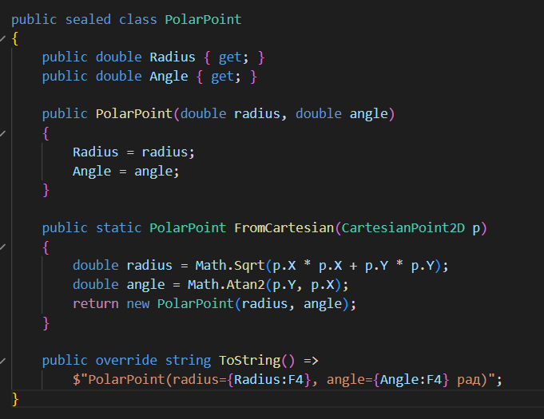
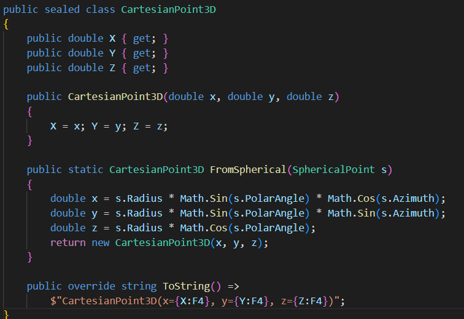
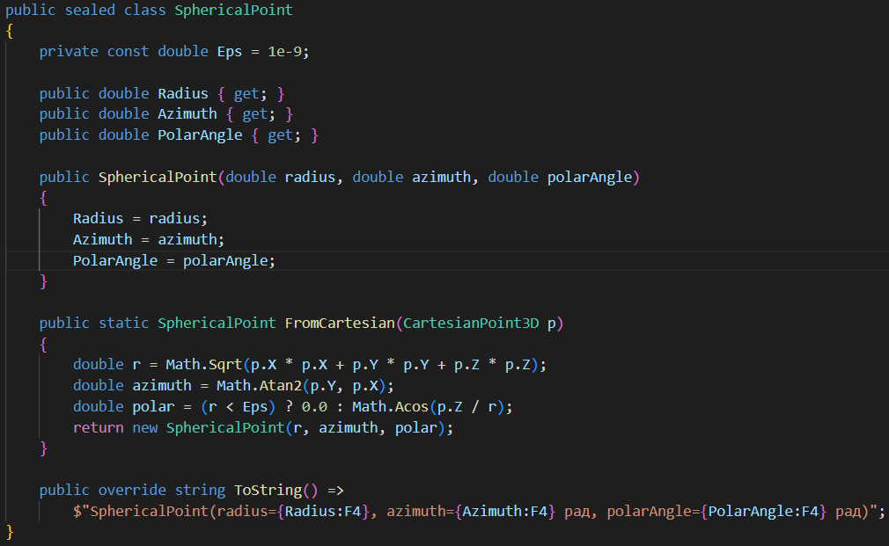

# CoordSystemsLab1
Бучко Вікторія IПЗ-4.02 Лаб № 1
Тема: Програмні моделі систем координат
Мета: 
- Спроектувати та реалізувати імутабельні програмні моделі для представлення точок у 2D та 3D системах координат.
- Реалізувати механізми перетворення між декартовою, полярною та сферичною системами координат з використанням статичних фабричних методів.
- Навчитись обчислювати відстані між точками, використовуючи різні математичні підходи.
- Провести аналіз продуктивності обчислень для різних представлень даних.

Вимоги до середовища
- Встановлена платформа .NET (версія 6.0 або новіша)
- Будь-яке середовище розробки (Visual Studio / VS Code...)

1. Проектування та реалізація імутабельних моделей даних
Необхідно спроектувати та реалізувати імутабельні (immutable) класи або структури для представлення точок. Після створення об'єкта його стан (координати) не повинен змінюватися.

Створіть наступні моделі даних:
- CartesianPoint2D(x, y)
- PolarPoint(radius, angle)
- CartesianPoint3D(x, y, z)
- SphericalPoint(radius, azimuth, polarAngle) (де radius - радіус-вектор , azimuth - азимутальний кут , polarAngle - полярний кут )

  

Рисунок 1 – CartesianPoint2D(x, y)

  

Рисунок 2 – PolarPoint(radius, angle)

  

Рисунок 3 – CartesianPoint3D(x, y, z)

  

Рисунок 4 – SphericalPoint(radius, azimuth, polarAngle)
