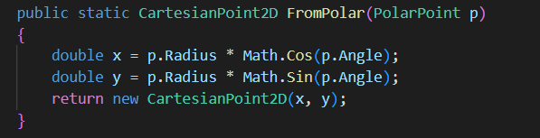
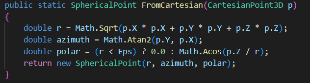

# CoordSystemsLab1
Бучко Вікторія IПЗ-4.02 Лаб № 1
Тема: Програмні моделі систем координат
Мета: 
- Спроектувати та реалізувати імутабельні програмні моделі для представлення точок у 2D та 3D системах координат.
- Реалізувати механізми перетворення між декартовою, полярною та сферичною системами координат з використанням статичних фабричних методів.
- Навчитись обчислювати відстані між точками, використовуючи різні математичні підходи.
- Провести аналіз продуктивності обчислень для різних представлень даних.

Вимоги до середовища
- Встановлена платформа .NET (версія 6.0 або новіша)
- Будь-яке середовище розробки (Visual Studio / VS Code...)

1. Проектування та реалізація імутабельних моделей даних
Необхідно спроектувати та реалізувати імутабельні (immutable) класи або структури для представлення точок. Після створення об'єкта його стан (координати) не повинен змінюватися.

Створіть наступні моделі даних:
- CartesianPoint2D(x, y)
- PolarPoint(radius, angle)
- CartesianPoint3D(x, y, z)
- SphericalPoint(radius, azimuth, polarAngle) (де radius - радіус-вектор , azimuth - азимутальний кут , polarAngle - полярний кут )

  

Рисунок 1 – CartesianPoint2D(x, y)

  

Рисунок 2 – PolarPoint(radius, angle)

  

Рисунок 3 – CartesianPoint3D(x, y, z)

  

Рисунок 4 – SphericalPoint(radius, azimuth, polarAngle)

2. Реалізовано статичні фабричні методи для перетворення між системами координат.

Для двовимірного простору (2D):
- у класі CartesianPoint2D реалізовано метод fromPolar(PolarPoint p)
- у класі PolarPoint реалізовано метод fromCartesian(CartesianPoint2D p)

  
Рисунок 5 – Метод fromPolar у класі CartesianPoint2D

  
Рисунок 6 – Метод fromCartesian у класі PolarPoint

Для тривимірного простору (3D):
- у класі CartesianPoint3D реалізовано метод fromSpherical(SphericalPoint p)
- у класі SphericalPoint реалізовано метод fromCartesian(CartesianPoint3D p)

  
Рисунок 7 – Метод fromSpherical у класі CartesianPoint3D

  
Рисунок 8 – Метод fromCartesian у класі SphericalPoint

3. Перевірка: Створіть кілька тестових точок, виконайте пряме та зворотне перетворення і переконайтесь, що початкові координати збігаються з кінцевими (з урахуванням похибки обчислень для чисел з плаваючою комою).

Оскільки обчислення виконуються з використанням чисел з плаваючою комою, для порівняння координат використовується мала похибка (Eps = 1e-9). Значення вважаються рівними, якщо їх різниця менша за задану похибку.
Результати перевірки виводяться у консоль у вигляді повідомлень «Збігаються» або «Не збігаються» для кожної координати.

  
Рисунок 9 – Перевірка коректності прямих та зворотних перетворень у 2D та 3D системах координат

2. Реалізація обчислення відстаней
   
На основі реалізованих моделей даних було створено набір функцій для обчислення відстаней між точками у 2D та 3D просторах.

Для цього реалізовано окремий статичний клас DistanceCalculator, який містить відповідні методи.

#### Відстань у 2D-просторі

- Метод Euclidean(CartesianPoint2D a, CartesianPoint2D b) обчислює евклідову відстань між двома точками у декартовій системі координат за стандартною формулою відстані.

- Метод Polar(PolarPoint a, PolarPoint b) обчислює відстань між точками безпосередньо у полярній системі координат, використовуючи теорему косинусів. Це дозволяє уникнути попереднього перетворення у декартову систему.

  
Рисунок 10 – Реалізація методів обчислення відстаней у 2D просторі

#### Відстань у 3D-просторі

- Метод SphericalChord(SphericalPoint a, SphericalPoint b) обчислює пряму відстань (хорду) між двома точками у тривимірному просторі. Цей підхід працює для точок з різними радіусами та фактично є аналогом евклідової відстані у 3D.

- Метод SphericalArc(SphericalPoint a, SphericalPoint b) обчислює дугову відстань по поверхні сфери (відстань великого кола). Даний метод застосовується для точок, що лежать на одній сфері з однаковим радіусом.

Додатково у методі використовується обмеження значення cosAngle у діапазоні [-1; 1] для уникнення помилок обчислення функції arccos через похибки чисел з плаваючою комою.

  
Рисунок 11 – Реалізація методів обчислення відстаней у 3D просторі
