# CoordSystemsLab1
Бучко Вікторія ІПЗ-4.02 Лаб № 1

---

## Тема: Програмні моделі систем координат

## Мета
- Спроектувати та реалізувати імутабельні програмні моделі для представлення точок у 2D та 3D системах координат.
- Реалізувати механізми перетворення між декартовою, полярною та сферичною системами координат з використанням статичних фабричних методів.
- Навчитись обчислювати відстані між точками, використовуючи різні математичні підходи.
- Провести аналіз продуктивності обчислень для різних представлень даних.

## Вимоги до середовища
- Встановлена платформа .NET (версія 6.0 або новіша)
- Будь-яке середовище розробки (Visual Studio / VS Code...)

## Інструкції для запуску проекту

1. Клонувати репозиторій:

```git clone https://github.com/VictoriaBuchko/CoordSystemsLab1.git```

2. Перейти у папку проєкту:

```cd CoordSystemsLab1```

3. Скомпілювати проєкт:

```dotnet build```

4. Запустити програму:

```dotnet run```

Після виконання команди dotnet run у консолі з’являться результати тестів перетворень між системами координат, обчислення відстаней та результати бенчмаркінгу продуктивності.

## 1. Проектування та реалізація імутабельних моделей даних
Необхідно спроектувати та реалізувати імутабельні (immutable) класи або структури для представлення точок. Після створення об'єкта його стан (координати) не повинен змінюватися.

Створіть наступні моделі даних:
- CartesianPoint2D(x, y)
- PolarPoint(radius, angle)
- CartesianPoint3D(x, y, z)
- SphericalPoint(radius, azimuth, polarAngle) (де radius - радіус-вектор , azimuth - азимутальний кут , polarAngle - полярний кут )

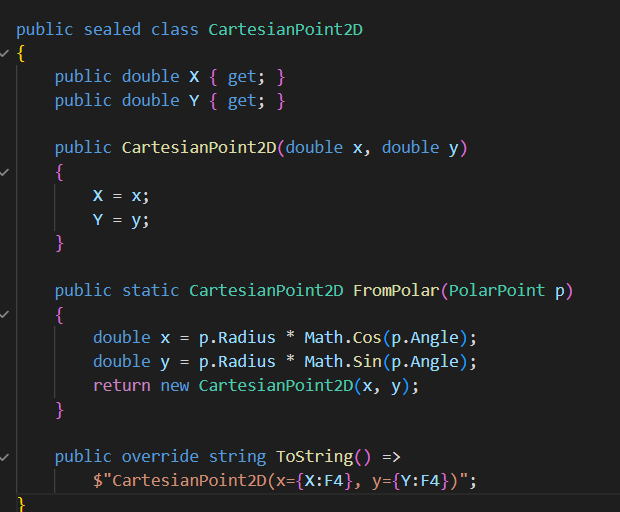  
Рисунок 1 – CartesianPoint2D(x, y)

  
Рисунок 2 – PolarPoint(radius, angle)

  
Рисунок 3 – CartesianPoint3D(x, y, z)

  
Рисунок 4 – SphericalPoint(radius, azimuth, polarAngle)

## 2. Реалізовано статичні фабричні методи для перетворення між системами координат
Для двовимірного простору (2D):
- у класі CartesianPoint2D реалізовано метод fromPolar(PolarPoint p)
- у класі PolarPoint реалізовано метод fromCartesian(CartesianPoint2D p)

  
Рисунок 5 – Метод fromPolar у класі CartesianPoint2D

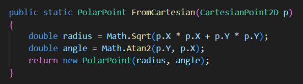  
Рисунок 6 – Метод fromCartesian у класі PolarPoint

Для тривимірного простору (3D):
- у класі CartesianPoint3D реалізовано метод fromSpherical(SphericalPoint p)
- у класі SphericalPoint реалізовано метод fromCartesian(CartesianPoint3D p)

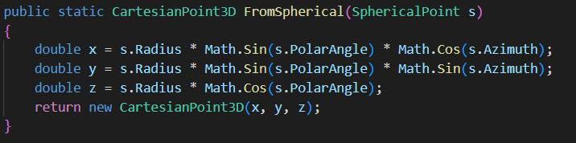  
Рисунок 7 – Метод fromSpherical у класі CartesianPoint3D

  
Рисунок 8 – Метод fromCartesian у класі SphericalPoint

## Перевірка коректності перетворень
Оскільки обчислення виконуються з використанням чисел з плаваючою комою, для порівняння координат використовується мала похибка (Eps = 1e-9). Значення вважаються рівними, якщо їх різниця менша за задану похибку.

Результати перевірки виводяться у консоль у вигляді повідомлень «Збігаються» або «Не збігаються» для кожної координати.

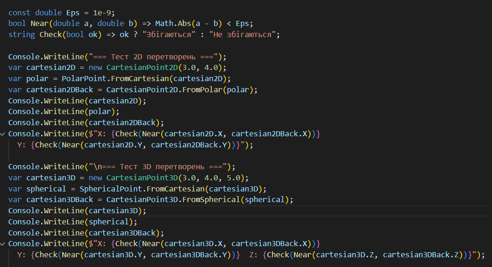  
Рисунок 9 – Перевірка коректності прямих та зворотних перетворень у 2D та 3D системах координат

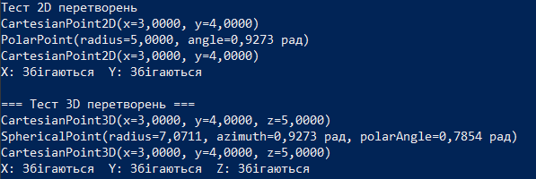  
Рисунок 10 – Перевірка коректності прямих та зворотних перетворень у 2D та 3D системах координат (результати)

## Реалізація обчислення відстаней

На основі реалізованих моделей даних було створено набір функцій для обчислення відстаней між точками у 2D та 3D просторах.

Для цього реалізовано окремий статичний клас DistanceCalculator, який містить відповідні методи.

### Відстань у 2D-просторі
- Метод Euclidean(CartesianPoint2D a, CartesianPoint2D b) обчислює евклідову відстань між двома точками у декартовій системі координат за стандартною формулою відстані.
- Метод Polar(PolarPoint a, PolarPoint b) обчислює відстань між точками безпосередньо у полярній системі координат, використовуючи теорему косинусів. Це дозволяє уникнути попереднього перетворення у декартову систему.

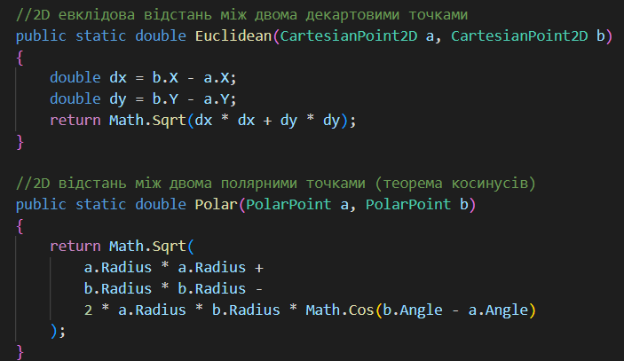  
Рисунок 11 – Реалізація методів обчислення відстаней у 2D просторі

### Відстань у 3D-просторі
- Метод SphericalChord(SphericalPoint a, SphericalPoint b) обчислює пряму відстань (хорду) між двома точками у тривимірному просторі. Цей підхід працює для точок з різними радіусами та фактично є аналогом евклідової відстані у 3D.
- Метод SphericalArc(SphericalPoint a, SphericalPoint b) обчислює дугову відстань по поверхні сфери (відстань великого кола). Даний метод застосовується для точок, що лежать на одній сфері з однаковим радіусом.

Додатково у методі використовується обмеження значення cosAngle у діапазоні [-1; 1] для уникнення помилок обчислення функції arccos через похибки чисел з плаваючою комою.

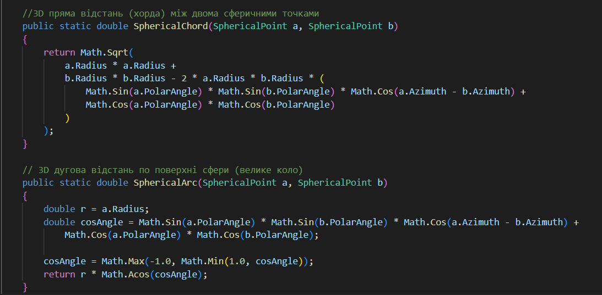  
Рисунок 12 – Реалізація методів обчислення відстаней у 3D просторі

### Перевірка обчислення відстаней
Для перевірки коректності реалізації методів обчислення відстаней було створено тестові приклади у 2D та 3D просторах.

У 2D-просторі:
- обчислено евклідову відстань між точками у декартовій системі координат
- обчислено відстань між точками у полярній системі координат за теоремою косинусів

У 3D-просторі:
- обчислено пряму відстань (хорду) між точками у сферичній системі координат
- обчислено дугову відстань по поверхні сфери

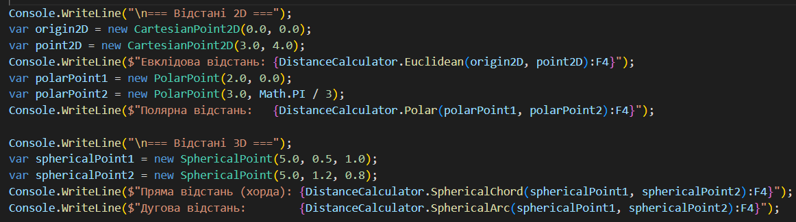  
Рисунок 13 – Код перевірки обчислення відстаней у 2D та 3D просторах

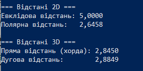  
Рисунок 14 – Результат виконання програми (вивід у консоль)

## 3. Аналіз продуктивності (Бенчмаркінг)
Метою даної частини є експериментальна оцінка продуктивності різних методів обчислення відстаней.

### Бенчмарк для 2D-простору
Було згенеровано масив із 100 000 пар випадкових точок у полярній системі координат. Додатково створено відповідний масив точок у декартовій системі координат шляхом попереднього перетворення.

Проведено вимірювання часу виконання для двох підходів:
- Підхід А — обчислення у полярних координатах (теорема косинусів)
- Підхід Б — обчислення у декартових координатах (евклідова відстань)

### Бенчмарк для 3D-простору
Було згенеровано масив із 100 000 пар точок у сферичній системі координат (з однаковими радіусами у межах кожної пари). Також створено відповідний масив у декартовій системі координат.

Проведено вимірювання часу для трьох підходів:
- Підхід А — сферична система (хорда)
- Підхід Б — сферична система (дугова відстань)
- Підхід В — декартова система (евклідова відстань)


**2D частина бенчмаркінгу**  
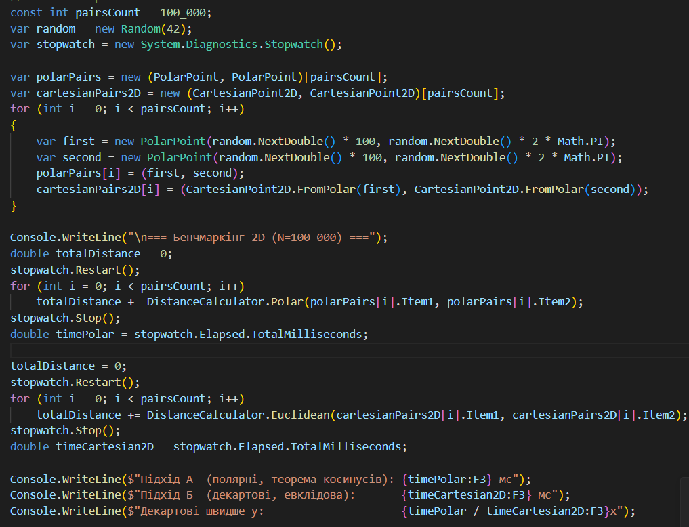  
Рисунок 15 – Код реалізації бенчмаркінгу (2D частина)

**3D частина бенчмаркінгу**  
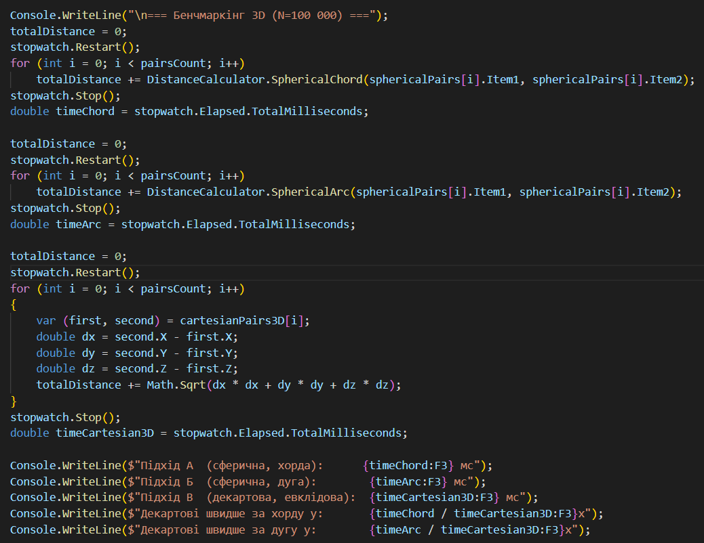  
Рисунок 16 – Код реалізації бенчмаркінгу (3D частина)

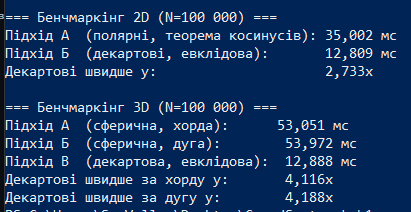  
Рисунок 17 – Результати вимірювання продуктивності (консольний вивід)


### Таблиця результатів

| Підхід                                      | Час виконання (мс) | Відносна швидкість          |
|---------------------------------------------|--------------------|-----------------------------|
| **2D Бенчмарк (N=100 000)**                 |                    |                             |
| Підхід А — Полярні (теорема косинусів)      | 35.002             | 1.00x                       |
| Підхід Б — Декартові (евклідова)            | 12.809             | **2.733x швидше**           |
| **3D Бенчмарк (N=100 000)**                 |                    |                             |
| Підхід А — Сферична хорда                   | 53.051             | 1.00x                       |
| Підхід Б — Сферична дуга                    | 53.972             | 0.983x                      |
| Підхід В — Декартова (евклідова)            | 12.188             | **4.355x швидше за хорду**  |
|                                             |                    | **4.428x швидше за дугу**   |

### Аналіз та висновки

**Для 2D:**  
Підхід А (полярні координати + теорема косинусів) виявився значно повільнішим — **2.733 раза** повільніше за декартовий  розрахунок. Для обчислення відстані в 2D краще використовувати декартові координати, навіть якщо початкові дані задані в полярній системі.

**Для 3D:**  
Найшвидшим виявився **декартовий евклідовий підхід** — він приблизно в **4.36 раза** швидший за хорду і в **4.43 раза** швидший за дугову відстань.  

**Загальний висновок:**  
Використання тригонометричних функцій суттєво знижує продуктивність. Найефективнішим рішенням для обчислення відстаней є попереднє перетворення в декартові координати та використання простої евклідової формули. Це підтверджує, що вибір представлення даних впливає не тільки на зручність, але й на швидкість виконання програми.

## 4. Загальний висновок

Під час виконання лабораторної роботи я закріпила навички створення імутабельних класів для представлення точок у різних системах координат, а також навчилася реалізовувати перетворення між декартовою, полярною та сферичною системами

Провела аналіз продуктивності. Порівняння показало, що обчислення відстані в декартових координатах значно швидше, ніж в полярній чи сферичній системах. Тригонометричні функції суттєво уповільнюють програму

